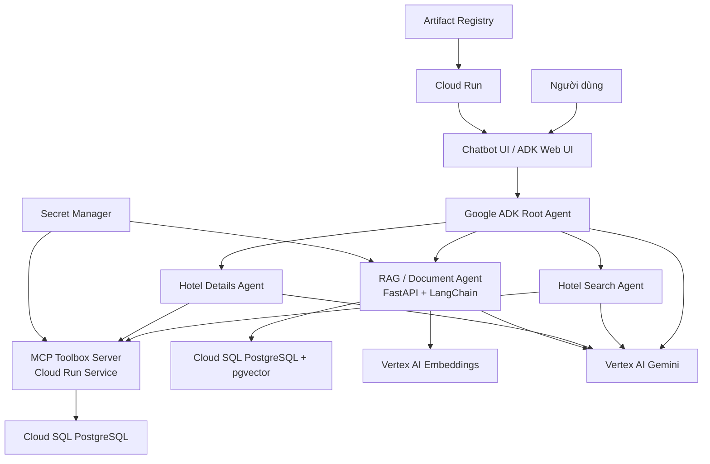

# Kế hoạch triển khai Chatbot AI Travel Agent trên GCP

## 1. Mục tiêu triển khai

Triển khai chatbot AI Travel Agent hỗ trợ người dùng tra cứu khách sạn tại Đà Nẵng bằng tiếng Việt. Chatbot có khả năng hiểu yêu cầu tự nhiên của người dùng, truy vấn dữ liệu khách sạn đã được chuẩn hóa trong Cloud SQL, sau đó trả lời về giá phòng, vị trí, tiện ích, đánh giá và thông tin chi tiết của từng khách sạn.

Hệ thống chatbot được triển khai trên Google Cloud Platform (GCP), sử dụng Google ADK để xây dựng agent, MCP Toolbox để kết nối agent với cơ sở dữ liệu, Vertex AI Gemini để xử lý ngôn ngữ tự nhiên và Cloud Run để vận hành dịch vụ serverless.

Kế hoạch cũng kết hợp thêm hướng triển khai chatbot production theo mô hình FastAPI + LangChain + Vertex AI + Cloud SQL pgvector. Phần này được đặt như một module mở rộng RAG, dùng cho dữ liệu phi cấu trúc như PDF báo cáo, mô tả du lịch, FAQ, chính sách đặt phòng hoặc tài liệu hướng dẫn. Như vậy hệ thống có hai lớp năng lực:

- Lớp dữ liệu có cấu trúc: ADK Agent gọi MCP tools để truy vấn Cloud SQL PostgreSQL.
- Lớp dữ liệu phi cấu trúc: LangChain RAG truy xuất nội dung đã embedding trong pgvector.

## 2. Phạm vi chatbot

Chatbot tập trung vào các chức năng chính sau:

- Tìm khách sạn theo mức giá tối đa và ngày nhận phòng.
- Tìm khách sạn gần địa danh cụ thể như Cầu Rồng, biển Mỹ Khê, sân bay, trung tâm thành phố.
- Xem thông tin chi tiết của khách sạn: mô tả, hạng sao, loại hình lưu trú, giờ nhận/trả phòng.
- Xem danh sách tiện ích của khách sạn.
- Xem điểm đánh giá theo từng tiêu chí như vị trí, vệ sinh, tiện nghi, nhân viên, wifi và mức đáng tiền.
- Trả lời bằng tiếng Việt tự nhiên, ngắn gọn, có tính tư vấn du lịch.


- Gợi ý lịch trình du lịch nhiều ngày. ( cố gắng làm được tính năng này )
- Trả lời có trích dẫn nguồn tài liệu hoặc đoạn văn liên quan.
- Kết hợp kết quả SQL có cấu trúc với ngữ cảnh văn bản phi cấu trúc.

## 3. Kiến trúc triển khai



## 4. Thành phần hệ thống

### 4.1. Cloud SQL PostgreSQL

Cloud SQL là cơ sở dữ liệu chính phục vụ chatbot. Dữ liệu được nạp từ pipeline ETL vào các bảng quan hệ:

- `hotels`: thông tin khách sạn.
- `hotel_locations`: địa chỉ và tọa độ.
- `hotel_facilities`: tiện ích.
- `hotel_nearby_places`: địa điểm lân cận.
- `hotel_reviews`: điểm đánh giá.
- `room_types`: loại phòng.
- `room_prices`: giá phòng theo ngày.

Cloud SQL phục vụ truy vấn thời gian thực cho chatbot thông qua MCP Toolbox.

### 4.2. MCP Toolbox Server

MCP Toolbox đóng vai trò cầu nối giữa agent và Cloud SQL. Các tool được khai báo trong `Booking/mcp/tools.yaml`, gồm:

- `find-hotels-by-price`: tìm khách sạn theo giá tối đa.
- `find-hotels-near-attraction`: tìm khách sạn gần địa danh.
- `get-hotel-details`: lấy thông tin chi tiết khách sạn.
- `get-hotel-facilities`: lấy danh sách tiện ích.
- `get-hotel-reviews`: lấy điểm đánh giá.

MCP Toolbox được triển khai thành Cloud Run Service riêng để agent có thể gọi tool qua URL.

### 4.3. Google ADK Agent

Thiết kế lại ADK Agent để trả lời được câu hỏi từ việc hiểu ngữ cảnh -> trích xuất nội dung thông tin phù hợp

Agent sử dụng model `gemini-2.5-flash` để hiểu ngôn ngữ tự nhiên, chọn tool phù hợp và tổng hợp kết quả trả lời. lưu api của gemni trong .env hoặc dùng vertex ai 

### 4.4. Cloud Run Service cho chatbot

Chatbot được đóng gói và triển khai trên Cloud Run Service. Cloud Run giúp hệ thống:

- Tự động mở rộng theo lượng người dùng.
- Scale-to-zero khi không có request để tiết kiệm chi phí.
- Dễ cập nhật phiên bản mới bằng container image.
- Tích hợp IAM, Secret Manager, Cloud Logging và Cloud Monitoring.

### 4.5. Module RAG mở rộng bằng FastAPI và LangChain

Module RAG được dùng khi chatbot cần trả lời dựa trên tài liệu phi cấu trúc, ví dụ file PDF báo cáo, tài liệu hướng dẫn triển khai, mô tả địa điểm du lịch hoặc FAQ.

Thành phần đề xuất:

- FastAPI backend với các endpoint:
  - `/health`: kiểm tra trạng thái dịch vụ.
  - `/ingest`: nhận tài liệu hoặc đoạn văn bản, tách chunk, tạo embedding và lưu vào pgvector.
  - `/chat`: nhận câu hỏi, truy xuất top-k đoạn liên quan, gọi Gemini/Vertex AI để tổng hợp câu trả lời.
  - `/admin`: kiểm tra số lượng tài liệu, trạng thái vector table hoặc thao tác quản trị.
- LangChain:
  - Điều phối bước chunking, embedding, retriever và prompt template.
  - Kết nối Vertex AI Embeddings và Vertex AI/Gemini model.
  - Kết nối PGVector để lưu và truy xuất vector.
- Cloud SQL PostgreSQL + pgvector:
  - Lưu nội dung tài liệu, embedding và metadata.
  - Hỗ trợ truy vấn tương đồng vector cho dữ liệu phi cấu trúc.

Schema gợi ý cho RAG:

```sql
CREATE EXTENSION IF NOT EXISTS vector;

CREATE TABLE IF NOT EXISTS rag_documents (
    id TEXT PRIMARY KEY,
    source TEXT,
    content TEXT NOT NULL,
    embedding VECTOR(768),
    metadata JSONB,
    created_at TIMESTAMP DEFAULT CURRENT_TIMESTAMP
);
```

Trong dự án hiện tại, module này nên được xem là phần bổ sung sau khi chatbot ADK + MCP đã chạy ổn định. Không nên thay thế MCP tools vì dữ liệu khách sạn dạng bảng vẫn phù hợp hơn với SQL truy vấn trực tiếp.

## 5. Luồng xử lý chatbot

### 5.1. Luồng tìm khách sạn theo giá

1. Người dùng hỏi: "Tìm khách sạn ở Đà Nẵng dưới 1 triệu ngày 2026-07-10".
2. `root_agent` nhận diện đây là yêu cầu tìm kiếm theo giá.
3. `root_agent` chuyển yêu cầu sang `hotel_search_agent`.
4. `hotel_search_agent` gọi tool `find-hotels-by-price`.
5. MCP Toolbox truy vấn bảng `room_prices`, `room_types` và `hotels` trong Cloud SQL.
6. Kết quả được trả về agent.
7. Agent tổng hợp danh sách khách sạn, loại phòng, giá và ngày nhận/trả phòng.

### 5.2. Luồng tìm khách sạn gần địa danh

1. Người dùng hỏi: "Có khách sạn nào gần Cầu Rồng trong bán kính 1 km không?"
2. `root_agent` chuyển yêu cầu sang `hotel_search_agent`.
3. Agent gọi tool `find-hotels-near-attraction`.
4. MCP Toolbox truy vấn bảng `hotel_nearby_places`, `hotels` và `hotel_locations`.
5. Chatbot trả lời danh sách khách sạn gần nhất, khoảng cách và địa chỉ.

### 5.3. Luồng hỏi chi tiết khách sạn

1. Người dùng hỏi: "Khách sạn Muong Thanh có tiện ích gì và điểm vệ sinh thế nào?"
2. `root_agent` chuyển yêu cầu sang `hotel_details_agent`.
3. Agent gọi các tool:
   - `get-hotel-details`
   - `get-hotel-facilities`
   - `get-hotel-reviews`
4. MCP Toolbox lấy dữ liệu từ Cloud SQL.
5. Agent tổng hợp thành câu trả lời tự nhiên, nêu tiện ích nổi bật và điểm đánh giá liên quan.

### 5.4. Luồng hỏi đáp tài liệu bằng RAG

1. Người dùng hỏi: "Trong báo cáo, kiến trúc GCP của hệ thống gồm những thành phần nào?"
2. `root_agent` nhận diện đây là câu hỏi về tài liệu hoặc nội dung phi cấu trúc.
3. Yêu cầu được chuyển sang module RAG/FastAPI.
4. Backend tạo embedding cho câu hỏi bằng Vertex AI Embeddings.
5. PGVector truy xuất các đoạn tài liệu liên quan nhất.
6. LangChain ghép context vào prompt và gọi Gemini/Vertex AI.
7. Chatbot trả lời kèm nguồn, ví dụ tên file PDF, chương hoặc metadata liên quan.

### 5.5. Luồng kết hợp SQL và RAG

1. Người dùng hỏi: "Gợi ý khách sạn gần biển Mỹ Khê và giải thích vì sao phù hợp cho gia đình."
2. Agent dùng MCP tool để tìm khách sạn gần biển Mỹ Khê.
3. Nếu cần thêm lý do tư vấn, agent gọi RAG để lấy nội dung mô tả du lịch, tiện ích gia đình hoặc hướng dẫn chọn khách sạn.
4. Chatbot tổng hợp câu trả lời gồm dữ liệu thực tế từ Cloud SQL và phần giải thích từ tài liệu.

## 6. Đánh giá hiện trạng GCP hiện tại

Snapshot được kiểm tra bằng Google Cloud SDK hiện tại ngày 2026-06-27, project `capstone-project-2-group-4`, region chính `asia-southeast1`.

### 6.1. File, folder và tài nguyên đang có trên GCP

- Cloud Storage:
  - `gs://capstone-project-2-group-4-data/raw_hotels_full.csv`: file dữ liệu nguồn đang dùng cho ETL.
  - `gs://run-sources-capstone-project-2-group-4-asia-southeast1/jobs/danang-etl-job/...zip`: source deploy của Cloud Run Job.
  - `gs://run-sources-capstone-project-2-group-4-asia-southeast1/services/danang-agent-service/...zip`: các bản source deploy của agent service.
  - `gs://capstone-project-2-group-4_cloudbuild/`: bucket Cloud Build.
- Cloud SQL:
  - Instance `danang-hotels-db`, PostgreSQL 15, trạng thái `RUNNABLE`.
  - Connection name: `capstone-project-2-group-4:asia-southeast1:danang-hotels-db`.
- Cloud Run:
  - Service `mcp-toolbox`: `Ready`, đang mount secret `mcp-tools-config`, kết nối Cloud SQL.
  - Service `danang-agent-service`: `Ready`, đang trỏ `MCP_TOOLBOX_URL` tới `mcp-toolbox`.
  - Job `danang-etl-job`: `Ready`, đã chạy thành công 4 lần.
- Cloud Scheduler:
  - Job `danang-etl-schedule`: `ENABLED`, lịch `0 0 * * *`, timezone `Asia/Ho_Chi_Minh`, lần chạy gần nhất thành công ngày 2026-06-27 00:00 giờ Việt Nam.
- Artifact Registry:
  - Repository `cloud-run-source-deploy`, có image `danang-etl-job:latest` và `danang-agent-service:latest`.
- BigQuery:
  - Dataset `danang_hotels_analytics`, có các bảng `hotels`, `hotel_locations`, `hotel_facilities`, `hotel_nearby_places`, `hotel_reviews`, `room_types`, `room_prices` và view `all_hotel_data_view`.
- Secret Manager:
  - Secret `mcp-tools-config` đã tồn tại.

### 6.2. Tiến độ đã hoàn thành

- Dữ liệu nguồn đã có trên GCS.
- Cloud SQL PostgreSQL đã tạo và đang chạy.
- ETL Cloud Run Job đã chạy thành công, log gần nhất ghi nhận:
  - `hotels`: 542 dòng.
  - `hotel_locations`: 542 dòng.
  - `hotel_facilities`: 4.400 dòng.
  - `hotel_nearby_places`: 12.895 dòng.
  - `hotel_reviews`: 542 dòng.
  - `room_types`: 3.937 dòng.
  - `room_prices`: 3.937 dòng.
- Scheduler đã tự kích hoạt ETL hằng ngày.
- MCP Toolbox đã deploy thành Cloud Run service và đang dùng secret mount cho `tools.yaml`.
- ADK agent đã deploy thành Cloud Run service, có cấu hình gọi MCP Toolbox.
- BigQuery analytics dataset đã có đủ bảng chính và view tổng hợp.

### 6.3. Vấn đề và khoảng trống hiện tại

- Mật khẩu database vẫn đang xuất hiện trong `Booking/mcp/tools.yaml` và env của `danang-etl-job`; cần chuyển sang Secret Manager đúng nghĩa thay vì hard-code.
- Cloud SQL đang bật public IPv4 và chưa bắt buộc SSL; nên siết lại sau khi xác nhận đường kết nối Cloud Run ổn định.
- Chưa có bằng chứng kiểm thử end-to-end chatbot qua URL Cloud Run với các câu hỏi thật.
- Chưa xác nhận trực tiếp từng MCP tool bằng request/API test độc lập.
- Agent service mới có `MCP_TOOLBOX_URL` và `GOOGLE_GENAI_USE_VERTEXAI`; nên bổ sung rõ `GOOGLE_CLOUD_PROJECT` và `GOOGLE_CLOUD_LOCATION`.
- Module RAG/FastAPI/LangChain/pgvector chưa được triển khai.
- Chưa có pipeline CI/CD chuẩn trong repo; hiện đang dựa nhiều vào deploy thủ công/source deploy.
- Chưa có monitoring dashboard, alert chi phí, alert lỗi hoặc tài liệu runbook vận hành.
- Log tiếng Việt trong ETL đang bị lỗi encoding hiển thị trên Cloud Logging; không chặn chức năng nhưng gây khó đọc khi debug.

## 7. Kế hoạch triển khai theo giai đoạn đã điều chỉnh

### Ưu tiên hiện tại

1. Khóa lại bảo mật secret và cấu hình runtime trước.
2. Kiểm thử end-to-end MCP + agent bằng dữ liệu thật.
3. Chuẩn hóa deploy/CI-CD cho các service đã chạy.
4. Chỉ triển khai RAG sau khi chatbot SQL ổn định.

### Giai đoạn 1: Chuẩn bị dữ liệu - đã hoàn thành, chỉ cần duy trì

- File nguồn hiện đang có trên GCS tại `gs://capstone-project-2-group-4-data/raw_hotels_full.csv`.
- Cloud SQL `danang-hotels-db` đã chạy.
- ETL đã nạp dữ liệu thành công vào PostgreSQL và BigQuery.
- Việc cần làm tiếp:
  - Chuẩn hóa tên bucket trong tài liệu/code để không còn lệch giữa `danang-hotels-raw-data` và `capstone-project-2-group-4-data`.
  - Thêm bước kiểm tra row count tự động sau mỗi lần ETL.
  - Sửa encoding log tiếng Việt để Cloud Logging đọc được.

### Giai đoạn 2: Củng cố MCP Toolbox - đang chạy, cần kiểm thử và bảo mật

- `mcp-toolbox` đã deploy và `Ready`.
- Secret `mcp-tools-config` đã tồn tại và đang được mount vào container.
- Việc cần làm tiếp:
  - Tách mật khẩu DB khỏi `tools.yaml`, chuyển sang secret/env an toàn theo khả năng hỗ trợ của MCP Toolbox.
  - Kiểm thử trực tiếp 5 tool: `find-hotels-by-price`, `find-hotels-near-attraction`, `get-hotel-details`, `get-hotel-facilities`, `get-hotel-reviews`.
  - Ghi lại mẫu request/response thành checklist kiểm thử.
  - Xác nhận service account `mcp-toolbox-sa` chỉ có quyền tối thiểu: Cloud SQL Client, Secret Accessor, Logging.

### Giai đoạn 3: Hoàn thiện chatbot ADK - đã deploy, cần xác minh hành vi

- `danang-agent-service` đã deploy và `Ready`.
- `MCP_TOOLBOX_URL` đã trỏ tới `mcp-toolbox`.
- Việc cần làm tiếp:
  - Bổ sung env rõ ràng `GOOGLE_CLOUD_PROJECT=capstone-project-2-group-4` và `GOOGLE_CLOUD_LOCATION=asia-southeast1`.
  - Kiểm tra agent có load đủ toolset `default` khi service khởi động.
  - Cải thiện instruction của agent để:
  - Trả lời bằng tiếng Việt.
  - Không bịa thông tin ngoài dữ liệu.
  - Hỏi lại nếu thiếu ngày, ngân sách hoặc tên địa danh.
  - Luôn trình bày kết quả có tên khách sạn, giá/khoảng cách/tiện ích chính.
  - Chạy bộ câu hỏi smoke test qua URL Cloud Run và lưu kết quả.

### Giai đoạn 4: Chuẩn hóa Cloud Run và CI/CD - cần làm tiếp

- Artifact Registry đã có image `danang-etl-job` và `danang-agent-service`.
- Việc cần làm tiếp:
  - Thêm `cloudbuild.yaml` cho ETL job, MCP config deploy và agent service.
  - Tạo service account riêng cho agent thay vì dùng Compute default service account.
  - Gán quyền tối thiểu cho agent: Vertex AI User, Logging, quyền gọi MCP nếu service được khóa IAM.
  - Cấu hình min/max instances phù hợp để tránh tăng chi phí.
  - Ghi lại URL production và lệnh rollback revision.

### Giai đoạn 5: Bổ sung module RAG cho PDF và tài liệu - hoãn sau khi SQL chatbot ổn định

- Tạo service FastAPI riêng, ví dụ `danang-rag-service`.
- Tạo endpoint `/ingest` để nạp PDF hoặc Markdown vào vector store.
- Tách tài liệu thành chunk theo kích thước phù hợp.
- Dùng Vertex AI Embeddings để tạo vector.
- Bật extension `pgvector` trên Cloud SQL PostgreSQL.
- Tạo bảng `rag_documents` để lưu chunk, embedding và metadata.
- Tạo endpoint `/chat` để truy vấn tài liệu.
- Cấu hình agent chính để gọi RAG service khi câu hỏi thuộc nhóm tài liệu, báo cáo, hướng dẫn hoặc nội dung phi cấu trúc.
- Nạp thử các tài liệu:
  - `Booking/docs/NHÓM 4 - BÁO CÁO TIẾN ĐỘ 2.pdf`
  - `Booking/docs/Walkthrough.md`
  - `Booking/docs/Ke_hoach_trien_khai_GCP_tap_trung_PDF.md`
  - `Booking/docs/Ke_hoach_trien_khai_chatbot_GCP.md`

### Giai đoạn 6: Hạ tầng tự động và vận hành

- Tạo Artifact Registry repository cho các image:
  - `danang-etl-job`
  - `mcp-toolbox`
  - `danang-agent-service`
  - `danang-rag-service` nếu triển khai RAG.
- Tạo `cloudbuild.yaml` cho từng service hoặc một pipeline chung.
- Pipeline cơ bản:
  - Build Docker image.
  - Push image lên Artifact Registry.
  - Deploy Cloud Run Service hoặc Cloud Run Job.
  - Gắn biến môi trường và secret.
- Có thể dùng Terraform để quản lý hạ tầng:
  - Enable APIs.
  - Tạo Cloud SQL instance.
  - Tạo Artifact Registry.
  - Tạo service accounts.
  - Gán IAM roles.
  - Tạo Cloud Run services/jobs.
  - Tạo Cloud Scheduler.
  - Tạo Secret Manager secrets.

### Giai đoạn 7: Kiểm thử end-to-end - ưu tiên ngay

- Kiểm thử nhóm câu hỏi tìm kiếm:
  - "Tìm khách sạn dưới 1 triệu."
  - "Tìm khách sạn gần Cầu Rồng dưới 2 km."
  - "Có khách sạn nào gần biển Mỹ Khê không?"
- Kiểm thử nhóm câu hỏi chi tiết:
  - "Khách sạn X có hồ bơi không?"
  - "Điểm vệ sinh của khách sạn X là bao nhiêu?"
  - "Khách sạn X check-in mấy giờ?"
- Kiểm thử trường hợp thiếu thông tin:
  - Người dùng không nói ngày nhận phòng.
  - Người dùng nhập tên khách sạn gần đúng.
  - Người dùng hỏi ngoài phạm vi dữ liệu.
- Kiểm tra Cloud Logging để phát hiện lỗi tool call, lỗi database hoặc lỗi Vertex AI.
- Kiểm thử nhóm câu hỏi RAG:
  - "Tóm tắt kiến trúc GCP trong báo cáo PDF."
  - "Các API GCP cần bật là gì?"
  - "Quy trình triển khai chatbot gồm những bước nào?"
  - "Rủi ro kỹ thuật chính của hệ thống là gì?"

### Giai đoạn 8: Giám sát và vận hành

- Bật Cloud Logging cho Cloud Run Service.
- Theo dõi các chỉ số:
  - Số request chatbot.
  - Latency trung bình.
  - Tỷ lệ lỗi HTTP 4xx/5xx.
  - Lỗi kết nối Cloud SQL.
  - Chi phí Vertex AI.
- Tạo budget alert cho project GCP.
- Thiết lập quy trình cập nhật dữ liệu định kỳ qua Cloud Run Job ETL và Cloud Scheduler.
- Theo dõi riêng cho RAG:
  - Số lượng tài liệu/chunk đã ingest.
  - Latency truy xuất vector.
  - Tỷ lệ câu trả lời không tìm được nguồn phù hợp.
  - Chi phí embedding khi nạp tài liệu mới.

## 8. Yêu cầu IAM và bảo mật

Service account cho chatbot cần quyền:

- `roles/aiplatform.user`: gọi Vertex AI Gemini.
- `roles/run.invoker`: nếu cần gọi service nội bộ.
- `roles/logging.logWriter`: ghi log.
- `roles/secretmanager.secretAccessor`: chỉ khi chatbot cần đọc secret.

Service account cho MCP Toolbox cần quyền:

- `roles/cloudsql.client`: kết nối Cloud SQL.
- `roles/secretmanager.secretAccessor`: đọc file cấu hình `tools.yaml` từ Secret Manager.
- `roles/logging.logWriter`: ghi log.

Service account cho RAG service cần quyền:

- `roles/aiplatform.user`: gọi Vertex AI Embeddings và Gemini.
- `roles/cloudsql.client`: kết nối Cloud SQL chứa pgvector.
- `roles/secretmanager.secretAccessor`: đọc thông tin kết nối database.
- `roles/logging.logWriter`: ghi log.

Cloud Build service account cần quyền:

- Push image lên Artifact Registry.
- Deploy Cloud Run Service/Job.
- Gắn service account runtime cho Cloud Run.
- Đọc secret cần thiết trong quá trình deploy nếu pipeline có sử dụng.

Nguyên tắc bảo mật:

- Không hard-code mật khẩu database trong source code hoặc PDF.
- Không public thông tin secret thật trong báo cáo.
- Với production, ưu tiên Cloud SQL private IP hoặc kết nối qua Cloud SQL Connector.
- Giới hạn quyền IAM theo nguyên tắc least privilege.

## 9. Biến môi trường đề xuất

Biến môi trường chung:

- `GOOGLE_CLOUD_PROJECT`: ID project GCP.
- `REGION`: region triển khai, đề xuất `asia-southeast1`.
- `GOOGLE_CLOUD_LOCATION`: location cho Vertex AI.
- `GOOGLE_GENAI_USE_VERTEXAI=True`: dùng Vertex AI thay vì API key trực tiếp.

Biến cho chatbot ADK:

- `MCP_TOOLBOX_URL`: URL Cloud Run Service của MCP Toolbox.

Biến cho MCP Toolbox:

- `CLOUD_SQL_CONNECTION_NAME`: dạng `project:region:instance`.
- `DB_NAME`: tên database PostgreSQL.
- `DB_USER`: user database.
- `DB_PASSWORD`: lấy từ Secret Manager, không hard-code trong repo.

Biến cho RAG service:

- `DATABASE_URL`: SQLAlchemy connection string hoặc cấu hình qua Cloud SQL Connector.
- `CLOUD_SQL_CONNECTION_NAME`: connection name Cloud SQL.
- `VECTOR_TABLE`: mặc định `rag_documents`.
- `EMBEDDING_MODEL`: model embedding Vertex AI.
- `GENERATION_MODEL`: model Gemini/Vertex AI dùng để sinh câu trả lời.
- `CHUNK_SIZE`: kích thước chunk tài liệu.
- `CHUNK_OVERLAP`: độ chồng lắp giữa các chunk.

## 10. Tiêu chí hoàn thành

Chatbot được xem là triển khai thành công khi đạt các tiêu chí sau:

- MCP Toolbox Cloud Run Service hoạt động và gọi được các SQL tools.
- ADK Agent load được toolset `default`.
- Người dùng có thể hỏi chatbot bằng tiếng Việt.
- Chatbot trả lời đúng dữ liệu trong Cloud SQL.
- Cloud Run Service của chatbot truy cập được qua URL.
- Log không còn lỗi nghiêm trọng về database, secret hoặc Vertex AI.
- Có ít nhất 5 kịch bản kiểm thử end-to-end thành công.
- Nếu triển khai RAG: nạp được PDF/Markdown vào pgvector và trả lời câu hỏi tài liệu có nguồn rõ ràng.
- CI/CD build và deploy được ít nhất chatbot service qua Cloud Build.

## 11. Rủi ro và hướng xử lý

- Nếu chatbot trả lời sai dữ liệu: kiểm tra SQL tool, dữ liệu Cloud SQL và instruction của agent.
- Nếu agent không gọi tool: kiểm tra tên tool trong `tools.yaml` và danh sách tool được load trong `agent.py`.
- Nếu MCP Toolbox không kết nối Cloud SQL: kiểm tra service account, Cloud SQL connection, secret mount và cấu hình instance.
- Nếu chi phí Vertex AI tăng: giới hạn max instances Cloud Run, theo dõi token usage và tối ưu prompt.
- Nếu dữ liệu cũ: lập lịch ETL định kỳ bằng Cloud Scheduler và Cloud Run Job.
- Nếu RAG trả lời không sát tài liệu: điều chỉnh chunk size, prompt, metadata và số lượng top-k.
- Nếu pgvector chậm khi dữ liệu tăng: thêm index vector phù hợp hoặc cân nhắc Vertex AI Vector Search.
- Nếu Cloud Run scale quá nhanh làm tăng kết nối database: giới hạn max instances/concurrency hoặc dùng connection pooling.

## 12. Hướng phát triển tiếp theo

- Xây dựng giao diện web chat riêng thay vì chỉ dùng ADK Web UI.
- Thêm chức năng gợi ý khách sạn theo nhóm người dùng: gia đình, cặp đôi, công tác, nghỉ dưỡng.
- Thêm truy vấn kết hợp nhiều điều kiện: giá, vị trí, tiện ích và điểm đánh giá.
- Tích hợp bản đồ để hiển thị khách sạn theo tọa độ.
- Thêm dashboard Looker Studio cho phân tích giá phòng và xu hướng du lịch.
- Mở rộng sang RAG tài liệu du lịch nếu cần chatbot trả lời thêm về lịch trình, địa điểm ăn uống và kinh nghiệm du lịch Đà Nẵng.
- Mở rộng RAG sang nhiều nguồn tài liệu: PDF, Markdown, website du lịch, chính sách khách sạn.
- Tạo Terraform template để tái tạo toàn bộ hạ tầng GCP.
- Bổ sung Cloud Monitoring dashboard và alert cho từng service.
