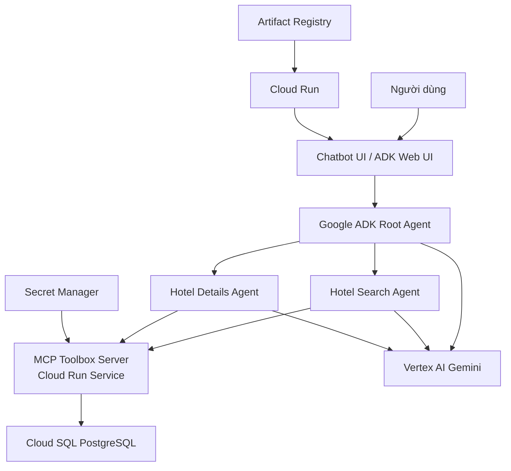

# Kế hoạch triển khai Chatbot AI Travel Agent trên GCP

## 1. Mục tiêu triển khai

Triển khai chatbot AI Travel Agent hỗ trợ người dùng tra cứu khách sạn tại Đà Nẵng bằng tiếng Việt. Chatbot có khả năng hiểu yêu cầu tự nhiên của người dùng, truy vấn dữ liệu khách sạn đã được chuẩn hóa trong Cloud SQL, sau đó trả lời về giá phòng, vị trí, tiện ích, đánh giá và thông tin chi tiết của từng khách sạn.

Hệ thống chatbot được triển khai trên Google Cloud Platform (GCP), sử dụng Google ADK để xây dựng agent, MCP Toolbox để kết nối agent với cơ sở dữ liệu, Vertex AI Gemini để xử lý ngôn ngữ tự nhiên và Cloud Run để vận hành dịch vụ serverless.

## 2. Phạm vi chatbot

Chatbot tập trung vào các chức năng chính sau:

- Tìm khách sạn theo mức giá tối đa và ngày nhận phòng.
- Tìm khách sạn gần địa danh cụ thể như Cầu Rồng, biển Mỹ Khê, sân bay, trung tâm thành phố.
- Xem thông tin chi tiết của khách sạn: mô tả, hạng sao, loại hình lưu trú, giờ nhận/trả phòng.
- Xem danh sách tiện ích của khách sạn.
- Xem điểm đánh giá theo từng tiêu chí như vị trí, vệ sinh, tiện nghi, nhân viên, wifi và mức đáng tiền.
- Trả lời bằng tiếng Việt tự nhiên, ngắn gọn, có tính tư vấn du lịch.

Các chức năng chưa triển khai trong giai đoạn đầu:

- Đặt phòng và thanh toán trực tiếp.
- Đồng bộ giá thời gian thực từ Booking.com.
- Gợi ý lịch trình du lịch nhiều ngày.
- Cá nhân hóa theo lịch sử người dùng.

## 3. Kiến trúc triển khai

## 4. Thành phần hệ thống

### 4.1. Cloud SQL PostgreSQL

Cloud SQL là cơ sở dữ liệu chính phục vụ chatbot. Dữ liệu được nạp từ pipeline ETL vào các bảng quan hệ:

- `hotels`: thông tin khách sạn.
- `hotel_locations`: địa chỉ và tọa độ.
- `hotel_facilities`: tiện ích.
- `hotel_nearby_places`: địa điểm lân cận.
- `hotel_reviews`: điểm đánh giá.
- `room_types`: loại phòng.
- `room_prices`: giá phòng theo ngày.

Cloud SQL phục vụ truy vấn thời gian thực cho chatbot thông qua MCP Toolbox.

### 4.2. MCP Toolbox Server

MCP Toolbox đóng vai trò cầu nối giữa agent và Cloud SQL. Các tool được khai báo trong `Booking/mcp/tools.yaml`, gồm:

- `find-hotels-by-price`: tìm khách sạn theo giá tối đa.
- `find-hotels-near-attraction`: tìm khách sạn gần địa danh.
- `get-hotel-details`: lấy thông tin chi tiết khách sạn.
- `get-hotel-facilities`: lấy danh sách tiện ích.
- `get-hotel-reviews`: lấy điểm đánh giá.

MCP Toolbox được triển khai thành Cloud Run Service riêng để agent có thể gọi tool qua URL.

### 4.3. Google ADK Agent

Chatbot sử dụng Google ADK trong thư mục `Booking/danang_hotel_agent`.

Cấu trúc agent:

- `root_agent`: nhận câu hỏi, phân tích ý định và chuyển tiếp sang agent phù hợp.
- `hotel_search_agent`: xử lý nhu cầu tìm khách sạn theo giá hoặc vị trí.
- `hotel_details_agent`: xử lý câu hỏi về thông tin, tiện ích và đánh giá của khách sạn.

Agent sử dụng model `gemini-2.5-flash` để hiểu ngôn ngữ tự nhiên, chọn tool phù hợp và tổng hợp kết quả trả lời.

### 4.4. Cloud Run Service cho chatbot

Chatbot được đóng gói và triển khai trên Cloud Run Service. Cloud Run giúp hệ thống:

- Tự động mở rộng theo lượng người dùng.
- Scale-to-zero khi không có request để tiết kiệm chi phí.
- Dễ cập nhật phiên bản mới bằng container image.
- Tích hợp IAM, Secret Manager, Cloud Logging và Cloud Monitoring.

## 5. Luồng xử lý chatbot

### 5.1. Luồng tìm khách sạn theo giá

1. Người dùng hỏi: "Tìm khách sạn ở Đà Nẵng dưới 1 triệu ngày 2026-07-10".
2. `root_agent` nhận diện đây là yêu cầu tìm kiếm theo giá.
3. `root_agent` chuyển yêu cầu sang `hotel_search_agent`.
4. `hotel_search_agent` gọi tool `find-hotels-by-price`.
5. MCP Toolbox truy vấn bảng `room_prices`, `room_types` và `hotels` trong Cloud SQL.
6. Kết quả được trả về agent.
7. Agent tổng hợp danh sách khách sạn, loại phòng, giá và ngày nhận/trả phòng.

### 5.2. Luồng tìm khách sạn gần địa danh

1. Người dùng hỏi: "Có khách sạn nào gần Cầu Rồng trong bán kính 1 km không?"
2. `root_agent` chuyển yêu cầu sang `hotel_search_agent`.
3. Agent gọi tool `find-hotels-near-attraction`.
4. MCP Toolbox truy vấn bảng `hotel_nearby_places`, `hotels` và `hotel_locations`.
5. Chatbot trả lời danh sách khách sạn gần nhất, khoảng cách và địa chỉ.

### 5.3. Luồng hỏi chi tiết khách sạn

1. Người dùng hỏi: "Khách sạn Muong Thanh có tiện ích gì và điểm vệ sinh thế nào?"
2. `root_agent` chuyển yêu cầu sang `hotel_details_agent`.
3. Agent gọi các tool:
   - `get-hotel-details`
   - `get-hotel-facilities`
   - `get-hotel-reviews`
4. MCP Toolbox lấy dữ liệu từ Cloud SQL.
5. Agent tổng hợp thành câu trả lời tự nhiên, nêu tiện ích nổi bật và điểm đánh giá liên quan.

## 6. Kế hoạch triển khai theo giai đoạn

### Giai đoạn 1: Chuẩn bị dữ liệu

- Kiểm tra file dữ liệu nguồn trong `Booking/data/raw_hotels_full.csv`.
- Chạy pipeline ETL local để xác minh dữ liệu sạch được sinh ra trong `Booking/etl/cleaned_tables`.
- Kiểm tra schema trong `Booking/database/schema.sql`.
- Khởi tạo Cloud SQL PostgreSQL và tạo bảng bằng `database/init_db.py`.
- Chạy ETL để nạp dữ liệu vào Cloud SQL.
- Dùng `database/check_db.py` kiểm tra số lượng dòng trong từng bảng.

### Giai đoạn 2: Triển khai MCP Toolbox

- Kiểm tra lại `Booking/mcp/tools.yaml`.
- Thay mật khẩu thật bằng Secret Manager khi triển khai production.
- Tạo Secret `mcp-tools-config` trên GCP.
- Triển khai MCP Toolbox bằng image chính thức lên Cloud Run.
- Mount `tools.yaml` từ Secret Manager vào container.
- Kết nối Cloud Run Service với Cloud SQL instance.
- Kiểm thử từng tool bằng request trực tiếp tới MCP Toolbox.

### Giai đoạn 3: Hoàn thiện chatbot ADK

- Kiểm tra file `Booking/danang_hotel_agent/agent.py`.
- Đảm bảo biến môi trường `MCP_TOOLBOX_URL` trỏ tới Cloud Run URL của MCP Toolbox.
- Kiểm tra các tool được load đúng từ toolset `default`.
- Cải thiện instruction của agent để:
  - Trả lời bằng tiếng Việt.
  - Không bịa thông tin ngoài dữ liệu.
  - Hỏi lại nếu thiếu ngày, ngân sách hoặc tên địa danh.
  - Luôn trình bày kết quả có tên khách sạn, giá/khoảng cách/tiện ích chính.
- Chạy thử agent local trước khi deploy.

### Giai đoạn 4: Triển khai chatbot lên Cloud Run

- Tạo `Dockerfile` cho thư mục `Booking/danang_hotel_agent` nếu chưa có.
- Tạo `requirements.txt` đầy đủ cho ADK, toolbox client và runtime web.
- Build image bằng Cloud Build.
- Đẩy image lên Artifact Registry.
- Tạo Cloud Run Service `danang-agent-service`.
- Cấu hình biến môi trường:
  - `MCP_TOOLBOX_URL`
  - `GOOGLE_GENAI_USE_VERTEXAI=True`
  - `GOOGLE_CLOUD_PROJECT`
  - `GOOGLE_CLOUD_LOCATION=asia-southeast1`
- Gán service account có quyền gọi Vertex AI và truy cập các secret cần thiết.
- Kiểm tra URL chatbot sau khi deploy.

### Giai đoạn 5: Kiểm thử end-to-end

- Kiểm thử nhóm câu hỏi tìm kiếm:
  - "Tìm khách sạn dưới 1 triệu."
  - "Tìm khách sạn gần Cầu Rồng dưới 2 km."
  - "Có khách sạn nào gần biển Mỹ Khê không?"
- Kiểm thử nhóm câu hỏi chi tiết:
  - "Khách sạn X có hồ bơi không?"
  - "Điểm vệ sinh của khách sạn X là bao nhiêu?"
  - "Khách sạn X check-in mấy giờ?"
- Kiểm thử trường hợp thiếu thông tin:
  - Người dùng không nói ngày nhận phòng.
  - Người dùng nhập tên khách sạn gần đúng.
  - Người dùng hỏi ngoài phạm vi dữ liệu.
- Kiểm tra Cloud Logging để phát hiện lỗi tool call, lỗi database hoặc lỗi Vertex AI.

### Giai đoạn 6: Giám sát và vận hành

- Bật Cloud Logging cho Cloud Run Service.
- Theo dõi các chỉ số:
  - Số request chatbot.
  - Latency trung bình.
  - Tỷ lệ lỗi HTTP 4xx/5xx.
  - Lỗi kết nối Cloud SQL.
  - Chi phí Vertex AI.
- Tạo budget alert cho project GCP.
- Thiết lập quy trình cập nhật dữ liệu định kỳ qua Cloud Run Job ETL và Cloud Scheduler.

## 7. Yêu cầu IAM và bảo mật

Service account cho chatbot cần quyền:

- `roles/aiplatform.user`: gọi Vertex AI Gemini.
- `roles/run.invoker`: nếu cần gọi service nội bộ.
- `roles/logging.logWriter`: ghi log.
- `roles/secretmanager.secretAccessor`: chỉ khi chatbot cần đọc secret.

Service account cho MCP Toolbox cần quyền:

- `roles/cloudsql.client`: kết nối Cloud SQL.
- `roles/secretmanager.secretAccessor`: đọc file cấu hình `tools.yaml` từ Secret Manager.
- `roles/logging.logWriter`: ghi log.

Nguyên tắc bảo mật:

- Không hard-code mật khẩu database trong source code hoặc PDF.
- Không public thông tin secret thật trong báo cáo.
- Với production, ưu tiên Cloud SQL private IP hoặc kết nối qua Cloud SQL Connector.
- Giới hạn quyền IAM theo nguyên tắc least privilege.

## 8. Tiêu chí hoàn thành

Chatbot được xem là triển khai thành công khi đạt các tiêu chí sau:

- MCP Toolbox Cloud Run Service hoạt động và gọi được các SQL tools.
- ADK Agent load được toolset `default`.
- Người dùng có thể hỏi chatbot bằng tiếng Việt.
- Chatbot trả lời đúng dữ liệu trong Cloud SQL.
- Cloud Run Service của chatbot truy cập được qua URL.
- Log không còn lỗi nghiêm trọng về database, secret hoặc Vertex AI.
- Có ít nhất 5 kịch bản kiểm thử end-to-end thành công.

## 9. Rủi ro và hướng xử lý

- Nếu chatbot trả lời sai dữ liệu: kiểm tra SQL tool, dữ liệu Cloud SQL và instruction của agent.
- Nếu agent không gọi tool: kiểm tra tên tool trong `tools.yaml` và danh sách tool được load trong `agent.py`.
- Nếu MCP Toolbox không kết nối Cloud SQL: kiểm tra service account, Cloud SQL connection, secret mount và cấu hình instance.
- Nếu chi phí Vertex AI tăng: giới hạn max instances Cloud Run, theo dõi token usage và tối ưu prompt.
- Nếu dữ liệu cũ: lập lịch ETL định kỳ bằng Cloud Scheduler và Cloud Run Job.

## 10. Hướng phát triển tiếp theo

- Xây dựng giao diện web chat riêng thay vì chỉ dùng ADK Web UI.
- Thêm chức năng gợi ý khách sạn theo nhóm người dùng: gia đình, cặp đôi, công tác, nghỉ dưỡng.
- Thêm truy vấn kết hợp nhiều điều kiện: giá, vị trí, tiện ích và điểm đánh giá.
- Tích hợp bản đồ để hiển thị khách sạn theo tọa độ.
- Thêm dashboard Looker Studio cho phân tích giá phòng và xu hướng du lịch.
- Mở rộng sang RAG tài liệu du lịch nếu cần chatbot trả lời thêm về lịch trình, địa điểm ăn uống và kinh nghiệm du lịch Đà Nẵng.
