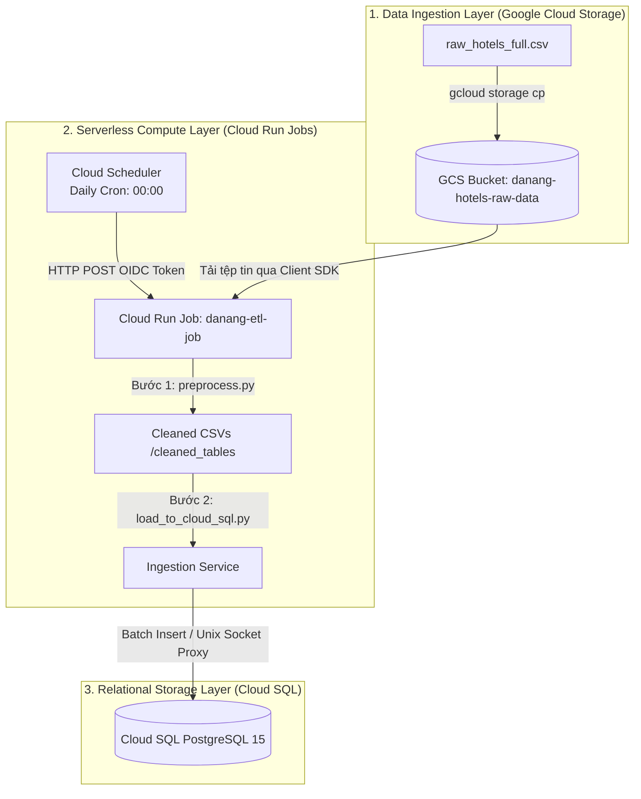
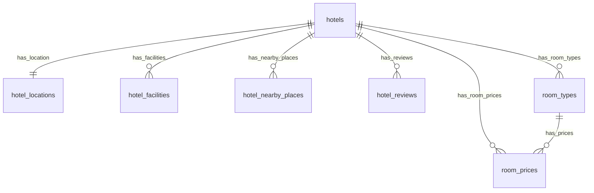

# BÁO CÁO KỸ THUẬT CHUYÊN SÂU: THIẾT KẾ ĐƯỜNG ỐNG ETL SERVERLESS & TRIỂN KHAI TRÊN NỀN TẢNG GOOGLE CLOUD PLATFORM (GCP)

---

## 1. Đặt Vấn Đề, Kiến Trúc Hệ Thống & Mô Hình Hóa Dữ Liệu Đích

### 1.1 Bối cảnh và Thách thức của Quy trình ETL
Trong các hệ thống phân tích và khai thác dữ liệu hiện đại, việc xây dựng một đường ống xử lý dữ liệu tự động, ổn định và có khả năng phục hồi lỗi là một yếu tố sống còn. Dữ liệu thô thu thập từ Booking.com chứa nhiều thông tin phi cấu trúc, trùng lặp và không tuân thủ các quy tắc toàn vẹn khóa ngoại của cơ sở dữ liệu quan hệ.

Báo cáo này tập trung vào thiết kế và triển khai **Serverless ETL Pipeline** chuyên biệt nhằm tự động hóa quy trình thu thập dữ liệu khách sạn Đà Nẵng, làm sạch và nạp vào kho dữ liệu quan hệ PostgreSQL trên nền tảng Google Cloud Platform (GCP).

### 1.2 Nguyên lý Thiết kế: Tách biệt Compute và Storage
Kiến trúc vật lý của hệ thống tuân thủ nghiêm ngặt nguyên lý tách rời **Tính toán (Compute)** và **Lưu trữ (Storage)**. Nguyên lý này mang lại ba lợi ích cốt lõi:
1. **Khả năng co giãn độc lập (Elasticity):** Khi dung lượng dữ liệu thô tăng từ megabyte lên terabyte, dung lượng lưu trữ của Cloud Storage tự động mở rộng mà không yêu cầu nâng cấp năng lực tính toán của Cloud Run. Ngược lại, khi cần xử lý biến đổi phức tạp, Cloud Run Jobs có thể tăng tài nguyên CPU/RAM mà không ảnh hưởng tới trạng thái lưu trữ dữ liệu.
2. **Tối ưu hóa chi phí (Cost Efficiency):** Lưu trữ trên GCS có chi phí cực thấp ($0.02 mỗi GB/tháng). Tiến trình tính toán chỉ chạy trong vài phút và tự động giải phóng tài nguyên ngay lập tức, triệt tiêu hoàn toàn chi phí duy trì phần cứng nhàn rỗi (Idle cost).
3. **Chịu lỗi và Cô lập tài nguyên (Fault Isolation):** Sự cố xảy ra tại lớp xử lý tính toán (ví dụ: lỗi tràn bộ nhớ RAM do file dữ liệu quá lớn) sẽ không gây nguy cơ mất mát dữ liệu hoặc ảnh hưởng tới tính khả dụng của cơ sở dữ liệu Cloud SQL đang phục vụ người dùng cuối.

### 1.3 Sơ đồ Kiến trúc Vật lý của Đường ống ETL (ETL Physical Topology)



### 1.4 Phân tích vai trò các thành phần hạ tầng ETL
*   **Google Cloud Storage (GCS) - Data Lake:** Nơi lưu giữ tệp tin dữ liệu thô (`raw_hotels_full.csv`). Định dạng lưu trữ được phân chia theo thời gian hoặc phiên bản để làm cơ sở đối chiếu và tái xử lý khi cần thiết.
*   **Cloud Run Jobs - Compute Engine:** Được cấu hình dưới dạng tác vụ chạy theo lô (Batch Job). So với Cloud Run Services (vốn được thiết kế cho các web service lắng nghe request liên tục), Cloud Run Jobs cho phép thực thi các tác vụ chạy ngầm kéo dài (lên tới 24 giờ), hỗ trợ cấu hình tài nguyên mạnh mẽ (lên tới 32 vCPU và 512 GB RAM) và tự hủy container sau khi xử lý thành công.
*   **Google Cloud SQL (PostgreSQL 15) - Data Warehouse:** Cơ sở dữ liệu quan hệ lưu trữ dữ liệu đã làm sạch. PostgreSQL được chọn nhờ khả năng hỗ trợ chỉ mục B-Tree ưu việt, các kiểu dữ liệu địa lý phong phú (PostGIS) và cơ chế kiểm soát đồng thời đa phiên bản (MVCC) giúp truy vấn nhanh chóng.
*   **Cloud Scheduler - Trigger Engine:** Bộ lập lịch cron-job kích hoạt tiến trình ETL hàng ngày. Điểm mấu chốt là Cloud Scheduler sử dụng cơ chế bảo mật cao cấp: tự động sinh mã xác thực **OIDC (OpenID Connect) Token** có chữ ký số của Google gắn với một Service Account được phân quyền tối thiểu, đảm bảo API thực thi Job không bị truy cập trái phép từ bên ngoài Internet.

### 1.5 Mô hình hóa Dữ liệu Đích (Data Modeling - Star Schema)
Để chuyển đổi dữ liệu từ dạng bảng phẳng (flat-table) có độ dư thừa cao sang cấu trúc quan hệ tối ưu hóa cho truy vấn phân tích, hệ thống áp dụng mô hình hình sao (**Star Schema**). Trung tâm của mô hình là các chiều thông tin của khách sạn (`hotels`) liên kết chặt chẽ với các bảng thực thể phụ thuộc:



*   **Bảng `hotels` (Bảng chiều gốc - Core Dimension):** Lưu trữ thông tin cơ bản của từng khách sạn như tên, mô tả chung, hạng sao, tổng số đánh giá và chính sách thời gian nhận/trả phòng.
*   **Bảng `hotel_locations` (Chiều địa lý - Geo Dimension):** Liên kết `1:1` với bảng `hotels`. Lưu trữ thông tin địa chỉ chi tiết, phường/quận, kinh độ (`longitude`), vĩ độ (`latitude`).
*   **Bảng `hotel_facilities` (Chiều thuộc tính - Dimension):** Lưu trữ danh sách các tiện ích nổi bật (như hồ bơi, spa, wifi miễn phí, chỗ đậu xe).
*   **Bảng `hotel_nearby_places` (Thực thể quan hệ khoảng cách):** Lưu trữ thông tin về các địa điểm lân cận (danh lam thắng cảnh, sân bay, bãi biển, nhà hàng). Bảng này đặc biệt quan trọng cho việc lọc khoảng cách bằng toán tử so sánh số học đơn giản (`<=`) trong cơ sở dữ liệu.
*   **Bảng `hotel_reviews` (Bảng chiều đánh giá chi tiết):** Lưu trữ các điểm số đánh giá thành phần như điểm nhân viên, điểm sạch sẽ, điểm thoải mái, điểm đáng giá tiền, và điểm trung bình chung.
*   **Bảng `room_types` (Chiều phòng - Room Dimension):** Định nghĩa cấu hình các loại phòng hiện có của từng khách sạn (ví dụ: Deluxe Double Room, Suite King).
*   **Bảng `room_prices` (Bảng sự kiện - Fact Table):** Lưu trữ lịch sử giá phòng biến động theo ngày check-in/check-out. Đây là bảng có tần suất cập nhật cao nhất và dung lượng lớn nhất trong hệ thống, ghi nhận thực tế giao dịch đặt phòng.

---

## 2. Quy Trình & Hướng Dẫn Triển Khai ETL 3 Giai Đoạn (Extract - Transform - Load)

### 2.1 GIAI ĐOẠN 1: EXTRACT (Trích xuất dữ liệu)

#### A. Giải thích cơ chế nạp dữ liệu thô đơn giản
Giai đoạn trích xuất (Extract) thực chất là quá trình **di chuyển file dữ liệu thô từ kho lưu trữ đám mây vào trong bộ nhớ của chương trình chạy** để chuẩn bị xử lý. Bạn có thể hình dung nó giống như việc bạn mở một file tài liệu từ ổ cứng mạng ra để làm việc thông qua 3 bước đơn giản sau:

1. **Bước 1: Lưu trữ file thô ở kho (Cloud Storage)**
   - File danh sách khách sạn chưa xử lý (`raw_hotels_full.csv`) được cất trữ an toàn trên đám mây tại **Google Cloud Storage** (đóng vai trò giống như một chiếc ổ cứng mạng).
2. **Bước 2: Tải file về máy ảo xử lý (Container)**
   - Khi đến giờ chạy ETL, máy chủ ảo của Google (Cloud Run Job) sẽ tự động khởi động. Việc đầu tiên máy chủ ảo này làm là tự động tải tệp tin CSV thô đó từ kho lưu trữ đám mây về phân vùng ổ cứng tạm thời của chính nó.
3. **Bước 3: Mở file vào RAM để làm việc (Pandas DataFrame)**
   - Sau khi file đã nằm ở ổ cứng tạm của máy ảo, chương trình Python sử dụng thư viện **Pandas** để "mở" (đọc) tệp CSV này lên bộ nhớ RAM dưới dạng một bảng dữ liệu gọi là **DataFrame** (`pd.read_csv`). Lúc này, toàn bộ dữ liệu đã sẵn sàng nằm trong bộ nhớ RAM để chuyển sang bước cắt lọc, làm sạch (Transform).


#### B. Hướng dẫn thiết lập Giao diện Web & Dòng lệnh trên GCP
Để chuẩn bị vùng đệm dữ liệu thô cho Giai đoạn Extract, ta thực hiện các bước cấu hình sau:

```bash
# 1. Kích hoạt API dịch vụ Storage trên dự án GCP
gcloud services enable storage.googleapis.com

# 2. Khởi tạo Storage Bucket tại khu vực Singapore để đạt độ trễ thấp
gcloud storage buckets create gs://danang-hotels-raw-data \
    --location=asia-southeast1 \
    --storage-class=STANDARD

# 3. Đẩy tệp tin dữ liệu khách sạn thô lên bucket vừa tạo
gcloud storage cp "E:\Cap 2\Booking\data\raw_hotels_full.csv" gs://danang-hotels-raw-data/raw_hotels_full.csv
```

---

### 2.2 GIAI ĐOẠN 2: TRANSFORM (Biến đổi & Làm sạch dữ liệu)

#### A. Lý thuyết & Giải thuật biến đổi
Giai đoạn biến đổi (`preprocess.py`) thực hiện một loạt các phép toán biến đổi dữ liệu thô dạng phẳng thành các cấu trúc bảng quan hệ sạch sẽ và chuẩn hóa cao:

*   **Chuẩn hóa văn bản bằng Unicode NFC:** Dữ liệu tiếng Việt thu thập từ web thường chứa các ký tự có dấu tổ hợp (Decomposed Unicode - NFD). Hệ thống sử dụng chuẩn **NFC (Canonical Composition)** để quy đổi về dạng ký tự dựng sẵn đơn nhất, tránh tình trạng so khớp chuỗi thất bại:
```python
import unicodedata
# Chuyển đổi về chuẩn ký tự dựng sẵn
unicodedata.normalize('NFC', text)
```
*   **Thuật toán sinh khóa xác thực (Deterministic ID Generation):** Để sinh khóa chính (`room_type_id`, `booking_id`) một cách nhất quán, không trùng lặp và loại bỏ ký tự tiếng Việt, dấu cách, ký tự đặc biệt nhằm phục vụ tính **Idempotency** khi chạy lại Job:
```python
# Chuyển chữ thường, bỏ dấu tiếng Việt và thay ký tự đặc biệt bằng '_'
text = re.sub(r'[^a-z0-9]', '_', clean_vietnamese(text))
room_type_id = f"{hotel_id}_{text}_{index}"
```
*   **Trích xuất thông tin bằng Biểu thức chính quy (Regex Parsers):**
```python
# Ví dụ trích xuất khoảng cách: "Hồ Xuân Hương 1,2 km" -> 1.2 km -> 1200 m
match = re.search(r'^(.*?)\s+([\d,.]+)\s*(km|m)\s*$', text)
meters = float(dist_val) * 1000 if unit == 'km' else float(dist_val)
```
*   **Phân nhóm và Xếp hạng địa lý (Group Ranking):** Sử dụng thuật toán xếp hạng khoảng cách tăng dần cho từng khách sạn bằng hàm `rank(method='first')` của Pandas để tối ưu hiệu năng truy vấn cho Agent:
```python
# Xếp hạng khoảng cách địa điểm lân cận theo từng nhóm khách sạn và loại địa điểm
df['distance_rank'] = df.groupby(['hotel_id', 'place_type'])['distance_in_meters'].rank(method='first')
```

#### B. Hướng dẫn đóng gói mã nguồn ETL bằng Cloud Build & Artifact Registry
Để chuẩn bị môi trường chạy mã nguồn biến đổi, ta cần đóng gói ứng dụng Python thành Docker Image.

**Cách 1: Sử dụng Giao diện Web GCP Console (Trực quan)**
1. **Tạo Repository trong Artifact Registry:**
   - Truy cập **Artifact Registry > Repositories** từ Menu chính của GCP Console.
   - Nhấp vào **+ CREATE REPOSITORY** và cấu hình: **Name:** `cloud-run-source-deploy`, **Format:** `Docker`, **Location:** Chọn `asia-southeast1 (Singapore)`.
2. **Cấu hình Trigger tự động đóng gói trên Cloud Build:**
   - Truy cập **Cloud Build > Triggers** trên GCP Console và click **+ CREATE TRIGGER**.
   - Thiết lập: **Name:** `danang-etl-trigger`, **Event:** `Push to a branch`, **Source:** Liên kết kho git chứa thư mục dự án `Booking`, **Configuration:** `Dockerfile` với image name:
     `asia-southeast1-docker.pkg.dev/capstone-project-2-group-4/cloud-run-source-deploy/danang-etl-job:$COMMIT_SHA`
3. **Thực thi Build:** Click **RUN** bên cạnh trigger vừa tạo và theo dõi log trong tab **History**.

**Cách 2: Sử dụng dòng lệnh gcloud CLI**
```bash
# 1. Kích hoạt API Cloud Build và Artifact Registry
gcloud services enable cloudbuild.googleapis.com artifactregistry.googleapis.com

# 2. Tạo Repository chứa Docker Image trong Artifact Registry
gcloud artifacts repositories create cloud-run-source-deploy \
    --repository-format=docker \
    --location=asia-southeast1 \
    --description="Docker repository for Danang Hotel ETL System"

# 3. Thực hiện build và push Docker Image lên Registry tự động
gcloud builds submit --tag asia-southeast1-docker.pkg.dev/capstone-project-2-group-4/cloud-run-source-deploy/danang-etl-job:latest .
```

---

### 2.3 GIAI ĐOẠN 3: LOAD (Nạp dữ liệu)

#### A. Lý thuyết nạp dữ liệu và Ràng buộc
Giai đoạn nạp dữ liệu (`load_to_cloud_sql.py`) đưa dữ liệu sạch vào cơ sở dữ liệu quan hệ Cloud SQL (PostgreSQL) và song song nạp vào kho dữ liệu BigQuery (OLAP):
*   **Batch Ingestion PostgreSQL (`execute_values`):** Thay vì thực hiện hàng nghìn câu lệnh `INSERT` đơn lẻ, hệ thống gom lô kích thước `page_size = 1000` và sử dụng mệnh đề `ON CONFLICT DO NOTHING` để tăng tốc độ ghi và đảm bảo tính **Idempotency**:
```python
from psycopg2.extras import execute_values
# Thực thi nạp lô lớn 1000 bản ghi, bỏ qua nếu trùng khóa chính
execute_values(cursor, "INSERT INTO table (...) VALUES %s ON CONFLICT DO NOTHING", records, page_size=1000)
```
*   **Nạp song song lên BigQuery Data Warehouse (OLAP):** Tiến trình sử dụng BigQuery Python SDK để đẩy dữ liệu sạch lên BigQuery. Đối với các bảng chiều (Dim), hệ thống sử dụng ghi đè (`WRITE_TRUNCATE`) để cập nhật bản mới nhất. Đối với bảng sự kiện Fact (`room_prices`), hệ thống dùng ghi nối tiếp (`WRITE_APPEND`) để tích lũy dữ liệu lịch sử phục vụ phân tích.
*   **Thứ tự nạp PostgreSQL theo Đồ thị hướng Acyclic (DAG):** Để tránh vi phạm ràng buộc toàn vẹn khóa ngoại (Foreign Key Constraints), thứ tự nạp dữ liệu vào PostgreSQL tuân thủ thứ tự:
$$\text{hotels} \rightarrow \begin{cases} 
\text{hotel\_locations} \\
\text{hotel\_facilities} \\
\text{hotel\_nearby\_places} \\
\text{hotel\_reviews} \\
\text{room\_types} \rightarrow \text{room\_prices}
\end{cases}$$

#### B. Hướng dẫn khởi tạo Database & Triển khai thực thi ETL Serverless trên GCP
Để hoàn thành giai đoạn nạp dữ liệu, ta cần khởi tạo cơ sở dữ liệu đích, phân quyền bảo mật, cấu hình Cloud Run Job chạy container ETL và lập lịch tự động.

```bash
# 1. Kích hoạt API Cloud SQL, Cloud Run, Cloud Scheduler và BigQuery
gcloud services enable sqladmin.googleapis.com \
    run.googleapis.com \
    scheduler.googleapis.com \
    bigquery.googleapis.com

# 2. Khởi tạo instance PostgreSQL 15 với cấu hình db-f1-micro tại Singapore
gcloud sql instances create danang-hotels-db \
    --database-version=POSTGRES_15 \
    --tier=db-f1-micro \
    --region=asia-southeast1 \
    --root-password="YourStrongDatabasePassword123"

# 3. Khởi tạo BigQuery Dataset tại Singapore
bq mk --location=asia-southeast1 danang_hotels_analytics

# 4. Tạo Service Account và gán quyền IAM (Storage, Cloud SQL và BigQuery)
gcloud iam service-accounts create danang-etl-sa \
    --description="Service Account for Danang Hotel ETL Pipeline Job" \
    --display-name="danang-etl-sa"

gcloud projects add-iam-policy-binding capstone-project-2-group-4 \
    --member="serviceAccount:danang-etl-sa@capstone-project-2-group-4.iam.gserviceaccount.com" \
    --role="roles/storage.objectViewer"

gcloud projects add-iam-policy-binding capstone-project-2-group-4 \
    --member="serviceAccount:danang-etl-sa@capstone-project-2-group-4.iam.gserviceaccount.com" \
    --role="roles/cloudsql.client"

gcloud projects add-iam-policy-binding capstone-project-2-group-4 \
    --member="serviceAccount:danang-etl-sa@capstone-project-2-group-4.iam.gserviceaccount.com" \
    --role="roles/bigquery.dataEditor"

gcloud projects add-iam-policy-binding capstone-project-2-group-4 \
    --member="serviceAccount:danang-etl-sa@capstone-project-2-group-4.iam.gserviceaccount.com" \
    --role="roles/bigquery.jobUser"
# 5. Khởi tạo Cloud Run Job thực thi ETL kết nối trực tiếp database qua Unix Socket Proxy
gcloud run jobs create danang-etl-job \
    --image=asia-southeast1-docker.pkg.dev/capstone-project-2-group-4/cloud-run-source-deploy/danang-etl-job:latest \
    --region=asia-southeast1 \
    --service-account=danang-etl-sa@capstone-project-2-group-4.iam.gserviceaccount.com \
    --add-cloudsql-instances=capstone-project-2-group-4:asia-southeast1:danang-hotels-db \
    --set-env-vars="DB_HOST=/cloudsql/capstone-project-2-group-4:asia-southeast1:danang-hotels-db" \
    --set-env-vars="DB_PORT=5432" \
    --set-env-vars="DB_NAME=postgres" \
    --set-env-vars="DB_USER=postgres" \
    --set-env-vars="DB_PASSWORD=YourStrongDatabasePassword123" \
    --set-env-vars="INPUT_BUCKET=danang-hotels-raw-data" \
    --set-env-vars="INPUT_FILE=raw_hotels_full.csv" \
    --max-retries=3 \
    --task-timeout=10m
# 6. Kích hoạt thực thi Job thủ công lần đầu
gcloud run jobs execute danang-etl-job --region=asia-southeast1

# 7. Đăng ký lịch chạy cron-job kích hoạt Job tự động vào lúc 00:00 hàng ngày (Giờ VN)
gcloud scheduler jobs create http danang-etl-schedule \
    --schedule="0 0 * * *" \
    --uri="https://asia-southeast1-run.googleapis.com/apis/run.googleapis.com/v1/namespaces/capstone-project-2-group-4/jobs/danang-etl-job:run" \
    --http-method=POST \
    --oauth-service-account-email="danang-etl-sa@capstone-project-2-group-4.iam.gserviceaccount.com" \
    --location=asia-southeast1 \
    --time-zone="Asia/Ho_Chi_Minh"
```
