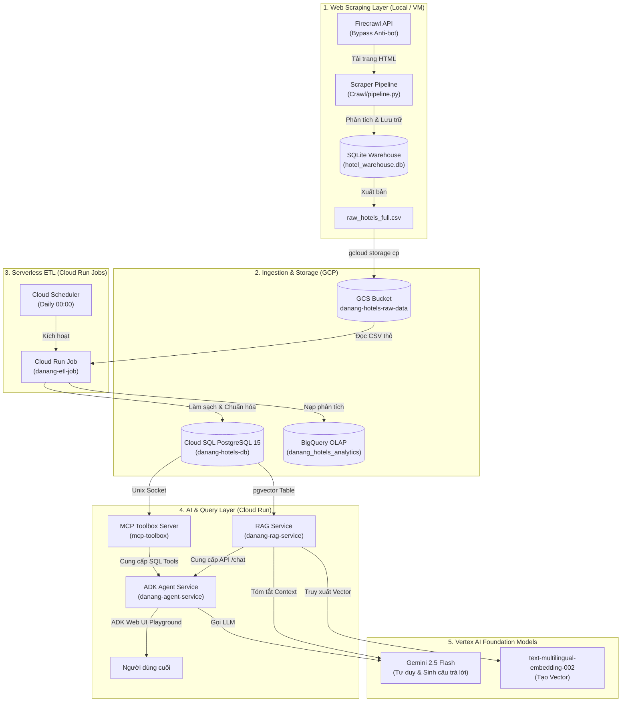

# Đà Nẵng AI Travel Agent & Serverless Data Pipeline (GCP)

Dự án này là một hệ thống toàn diện từ đầu đến cuối (End-to-End Pipeline) kết hợp việc **thu thập dữ liệu khách sạn tại Đà Nẵng**, **xây dựng đường ống biến đổi và làm sạch dữ liệu tự động (Serverless ETL)** trên nền tảng **Google Cloud Platform (GCP)**, thiết lập **máy chủ cơ sở dữ liệu MCP (Model Context Protocol)**, phát triển **Module RAG (FastAPI + pgvector)** cho dữ liệu phi cấu trúc, và xây dựng một **trợ lý du lịch ảo thông minh đa tác nhân (Multi-Agent Travel Assistant)** bằng **Google ADK**.

Hệ thống cho phép người dùng tìm kiếm, lọc giá phòng, tra cứu thông tin chi tiết (tiện ích, đánh giá, khoảng cách tới các điểm du lịch) và hỏi đáp về các báo cáo/tài liệu dự án bằng ngôn ngữ tự nhiên thông qua giao diện Web Chat trực quan.

---

## 1. Sơ Đồ Kiến Trúc Hệ Thống (Architecture Diagram)

Kiến trúc vật lý của hệ thống tuân thủ nguyên lý tách rời **Tính toán (Compute)** và **Lưu trữ (Storage)** để đảm bảo khả năng co giãn linh hoạt, tính chịu lỗi cao và tối ưu hóa chi phí:



---
## 2. Cấu Trúc Thư Mục Dự Án (Project Structure)

Dự án được tổ chức gọn gàng trong thư mục `Booking` với các thành phần chính sau:

```text
d:\GCP\Booking/
├── Crawl/                         # 1. Booking.com Scraper (Firecrawl API)
│   ├── src/                       # Mã nguồn xử lý cào, phân tích và lưu SQLite
│   │   ├── scraper.py             # Kết nối Firecrawl tải trang HTML
│   │   ├── parser.py              # Trích xuất dữ liệu chi tiết bằng BeautifulSoup4
│   │   ├── db_setup.py            # Cấu trúc bảng SQLite cục bộ
│   │   └── pipeline.py            # Quy trình cào chính
│   ├── pipeline.py                # Wrapper thực thi scraper
│   └── requirements.txt           # Dependencies của scraper (firecrawl-py, bs4, pandas)
│
├── etl/                         # 2. Đường ống Serverless ETL (Cloud Run Job)
│   ├── preprocess.py              # Làm sạch văn bản (Unicode NFC), regex chuẩn hóa khoảng cách (mét)
│   ├── load_to_cloud_sql.py       # Nạp song song vào Cloud SQL (PostgreSQL) và BigQuery
│   ├── run_etl.py                 # Điều phối chạy toàn bộ pipeline ETL
│   ├── Dockerfile                 # Đóng gói môi trường chạy ETL Job
│   └── requirements_etl.txt       # Dependencies của ETL (psycopg2, google-cloud-bigquery)
│
├── database/                    # 3. Thiết lập Schema cơ sở dữ liệu PostgreSQL
│   ├── schema.sql                 # Khai báo cấu trúc bảng đích
│   └── init_db.py                 # Script khởi tạo bảng và index trên Cloud SQL
│
├── danang_hotel_agent/          # 4. AI Travel Agent (Google ADK)
│   ├── agent.py                   # Định nghĩa 4 Agents (Root, Search, Details, RAG Document)
│   ├── mcp/                       # Cấu hình Model Context Protocol (MCP)
│   │   └── tools.yaml             # Khai báo 5 SQL tools kết nối DB (đã thêm LIMIT 50 tối ưu hóa)
│   │
│   ├── rag/                       # 5. Module RAG mở rộng (FastAPI + pgvector)
│   │   ├── main.py                # FastAPI endpoints (/health, /chat, /ingest/file, /admin)
│   │   ├── rag_chain.py           # Chunking, Vertex AI Embedding & Gemini Generation
│   │   ├── db.py                  # Kết nối Cloud SQL pgvector & quản lý bảng rag_documents
│   │   ├── ingest_docs.py         # CLI nạp tài liệu PDF/Markdown vào pgvector
│   │   ├── Dockerfile             # Dockerfile chạy uvicorn port 8080
│   │   └── requirements.txt       # Dependencies (fastapi, pgvector, pypdf, google-cloud-aiplatform)
│   │
│   ├── Dockerfile                 # Đóng gói Agent chạy adk api_server với --with_ui và --auto_create_session
│   └── requirements.txt           # Dependencies (google-adk, toolbox-core, requests)
│
└── docs/                        # 6. Tài liệu hướng dẫn thiết kế & vận hành
```

---

## 3. Chi Tiết Các Thành Phần Hệ Thống

### 3.1. Web Scraper (`Crawl`)
* **Cơ chế**: Sử dụng **Firecrawl API** để vượt qua các lớp tường lửa chống bot (Cloudflare) của Booking.com một cách hợp lệ.
* **SQLite Warehouse**: Đóng vai trò làm kho đệm (staging), lưu trữ dữ liệu có quan hệ theo mô hình hình sao (Star Schema) trước khi kết xuất ra file CSV.

### 3.2. Serverless ETL (`etl`)
* **Xử lý khoảng cách**: Sử dụng biểu thức chính quy (Regex) để bóc tách các chuỗi khoảng cách phi cấu trúc (ví dụ: `"Cầu Rồng 1,2 km"`, `"Bãi tắm Mỹ Khê 850 m"`) đưa về dạng số nguyên thống nhất theo đơn vị mét (`1200`, `850`).
* **Chuẩn hóa Tiếng Việt**: Chuẩn hóa Unicode về dạng dựng sẵn **NFC** để tránh lỗi so sánh chuỗi tiếng Việt trên PostgreSQL.
* **Idempotency**: Sinh mã định danh nhất quán (Deterministic ID) giúp quá trình chạy lại ETL không bao giờ bị trùng lặp dữ liệu.
* **Tải dữ liệu**: Sử dụng cơ chế nạp hàng loạt (Batch Insert) kết hợp `ON CONFLICT DO NOTHING` trên PostgreSQL và ghi đè trên BigQuery.

### 3.3. MCP Toolbox (`danang_hotel_agent/mcp`)
* Đóng vai trò là cầu nối bảo mật giữa LLM và cơ sở dữ liệu quan hệ.
* Khai báo 5 công cụ SQL trong `tools.yaml` kết nối trực tiếp đến Cloud SQL PostgreSQL (được tối ưu hóa bằng mệnh đề `LIMIT 50` để kiểm soát kích thước dữ liệu truyền vào prompt của LLM, tránh tình trạng quá tải và timeout 60 giây).

### 3.4. Module RAG (`danang_hotel_agent/rag`)
* Phục vụ truy xuất thông tin từ tài liệu phi cấu trúc (như file báo cáo PDF, kế hoạch triển khai, hướng dẫn du lịch).
* Sử dụng **Vertex AI `text-multilingual-embedding-002`** tạo vector 768 chiều và lưu trữ trong bảng `rag_documents` kích hoạt extension `pgvector` trên Cloud SQL.
* Tổng hợp câu trả lời thông qua **Gemini 2.5 Flash** kèm trích dẫn nguồn tài liệu cụ thể.

### 3.5. Multi-Agent AI Agent (`danang_hotel_agent`)
Được thiết kế dựa trên kiến trúc **Multi-Agent Orchestration** của Google ADK:
* **Root Agent (`danang_hotel_agent`)**: Đóng vai trò là Đại sứ Du lịch Đà Nẵng, tiếp nhận câu hỏi, điều phối công việc cho các agent con và tổng hợp câu trả lời tự nhiên, thân thiện.
* **Search Agent (`hotel_search_agent`)**: Gọi các MCP tools tìm kiếm khách sạn theo giá phòng và khoảng cách địa lý. Hỗ trợ **truy vấn kết hợp** (gọi cả 2 tool và tự so khớp/giao nhau danh sách trong bước suy nghĩ).
* **Detail Agent (`hotel_details_agent`)**: Gọi các MCP tools xem chi tiết mô tả, tiện ích và điểm đánh giá của khách sạn cụ thể.
* **RAG Agent (`rag_document_agent`)**: Gọi RAG Service qua HTTP để trả lời các câu hỏi về tài liệu dự án, kiến trúc hệ thống hoặc quy trình.

---

## 4. Hướng Dẫn Triển Khai Trên GCP (Deployment Guide)

*Lưu ý: Các lệnh dưới đây sử dụng định dạng `gcloud.cmd` tương thích tốt nhất với PowerShell trên Windows.*

### 4.1. Chuẩn bị tài nguyên & Khởi tạo Database
```bash
# 1. Bật các API cần thiết trên dự án GCP
gcloud.cmd services enable storage.googleapis.com \
    cloudbuild.googleapis.com \
    artifactregistry.googleapis.com \
    sqladmin.googleapis.com \
    run.googleapis.com \
    scheduler.googleapis.com \
    aiplatform.googleapis.com

# 2. Tạo GCS Bucket và tải file dữ liệu thô lên
gcloud.cmd storage buckets create gs://capstone-project-2-group-4-data --location=asia-southeast1
gcloud.cmd storage cp "data/raw_hotels_full.csv" gs://capstone-project-2-group-4-data/raw_hotels_full.csv

# 3. Tạo cơ sở dữ liệu Cloud SQL (PostgreSQL 15)
gcloud.cmd sql instances create danang-hotels-db \
    --database-version=POSTGRES_15 \
    --tier=db-f1-micro \
    --region=asia-southeast1 \
    --root-password="YourStrongDatabasePassword123"
```

### 4.2. Triển khai MCP Toolbox
1. Tạo một secret trong Secret Manager có tên `mcp-tools-config` chứa nội dung file `Booking/danang_hotel_agent/mcp/tools.yaml`.
2. Triển khai dịch vụ `mcp-toolbox` trên Cloud Run, thực hiện mount secret trên vào đường dẫn `/app/tools.yaml` và kết nối trực tiếp đến cơ sở dữ liệu Cloud SQL.

### 4.3. Triển khai RAG Service
```bash
cd danang_hotel_agent/rag

# 1. Build và deploy RAG Service lên Cloud Run
gcloud.cmd run deploy danang-rag-service \
  --source . \
  --region asia-southeast1 \
  --set-env-vars "GOOGLE_CLOUD_PROJECT=capstone-project-2-group-4,GOOGLE_CLOUD_LOCATION=asia-southeast1,CLOUD_SQL_CONNECTION_NAME=capstone-project-2-group-4:asia-southeast1:danang-hotels-db,DB_NAME=postgres,DB_USER=postgres,DB_PASSWORD=YourStrongDatabasePassword123" \
  --add-cloudsql-instances capstone-project-2-group-4:asia-southeast1:danang-hotels-db \
  --allow-unauthenticated
```

### 4.4. Triển khai Agent Service (ADK với Web UI)
```bash
cd ..

# 1. Build và deploy Agent Service lên Cloud Run
# Sử dụng --with_ui để kích hoạt giao diện chat playground tại URL gốc và --auto_create_session để tự tạo session
gcloud.cmd run deploy danang-agent-service \
  --source . \
  --region asia-southeast1 \
  --set-env-vars "MCP_TOOLBOX_URL=https://mcp-toolbox-364283911624.asia-southeast1.run.app,RAG_SERVICE_URL=https://danang-rag-service-364283911624.asia-southeast1.run.app,GOOGLE_GENAI_USE_VERTEXAI=True,GOOGLE_CLOUD_PROJECT=capstone-project-2-group-4,GOOGLE_CLOUD_LOCATION=asia-southeast1" \
  --allow-unauthenticated
```

### 4.5. Triển khai ETL Job và đặt lịch hàng ngày
```bash
cd ../etl

# 1. Build và submit image của ETL Job
gcloud.cmd builds submit --tag asia-southeast1-docker.pkg.dev/capstone-project-2-group-4/cloud-run-source-deploy/danang-etl-job:latest .

# 2. Tạo Cloud Run Job thực thi ETL kết nối Cloud SQL qua Unix Socket
gcloud.cmd run jobs create danang-etl-job \
    --image=asia-southeast1-docker.pkg.dev/capstone-project-2-group-4/cloud-run-source-deploy/danang-etl-job:latest \
    --region=asia-southeast1 \
    --add-cloudsql-instances=capstone-project-2-group-4:asia-southeast1:danang-hotels-db \
    --set-env-vars="DB_HOST=/cloudsql/capstone-project-2-group-4:asia-southeast1:danang-hotels-db,DB_PORT=5432,DB_NAME=postgres,DB_USER=postgres,DB_PASSWORD=YourStrongDatabasePassword123,INPUT_BUCKET=capstone-project-2-group-4-data,INPUT_FILE=raw_hotels_full.csv"

# 3. Tạo Cloud Scheduler tự động gọi Job ETL lúc 00:00 hàng ngày (Giờ Việt Nam)
gcloud.cmd scheduler jobs create http danang-etl-schedule \
    --schedule="0 0 * * *" \
    --uri="https://asia-southeast1-run.googleapis.com/apis/run.googleapis.com/v1/namespaces/capstone-project-2-group-4/jobs/danang-etl-job:run" \
    --http-method=POST \
    --oauth-service-account-email="danang-etl-sa@capstone-project-2-group-4.iam.gserviceaccount.com" \
    --location=asia-southeast1 \
    --time-zone="Asia/Ho_Chi_Minh"
```

---

## 5. Hướng Dẫn Kiểm Thử (Testing Guide)

Bạn có thể tìm thấy bộ kịch bản kiểm thử chi tiết bao gồm các câu hỏi mẫu cho tính năng tìm kiếm, xem chi tiết, và hỏi đáp tài liệu RAG tại file: [chat_test_cases.md](file:///C:/Users/hoang/.gemini/antigravity-ide/brain/aa0aca8e-4e25-4ceb-a82d-002602b16065/chat_test_cases.md)

### 5.1. Kiểm tra trạng thái dịch vụ (Health Check)
* **Agent Service**: Truy cập `https://danang-agent-service-364283911624.asia-southeast1.run.app/health` -> Trả về `{"status":"ok"}`.
* **RAG Service**: Truy cập `https://danang-rag-service-364283911624.asia-southeast1.run.app/health` -> Trả về `{"status":"ok","service":"danang-rag-service"}`.

### 5.2. Chạy thử nghiệm qua giao diện Web
Truy cập trực tiếp URL của Agent Service:
👉 **[https://danang-agent-service-364283911624.asia-southeast1.run.app](https://danang-agent-service-364283911624.asia-southeast1.run.app)**

Hệ thống sẽ tự động chuyển hướng sang giao diện **ADK Web UI playground** để bạn nhập câu hỏi trò chuyện trực tiếp với trợ lý du lịch.
