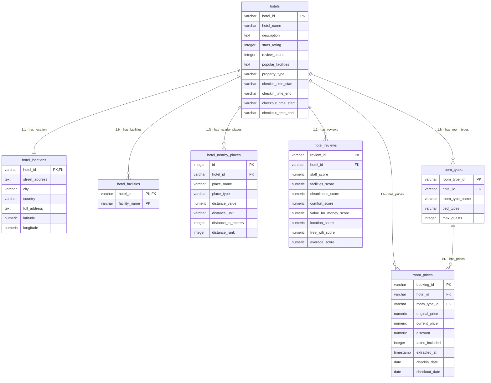

# Da Nang AI Travel Agent & Serverless ETL Pipeline

Dự án này là một hệ thống toàn diện từ đầu đến cuối (End-to-End Pipeline) kết hợp việc **thu thập dữ liệu khách sạn tại Đà Nẵng**, **xây dựng đường ống biến đổi và làm sạch dữ liệu tự động (Serverless ETL)** trên nền tảng **Google Cloud Platform (GCP)**, thiết lập **máy chủ cơ sở dữ liệu MCP (Model Context Protocol)** và phát triển một **trợ lý du lịch ảo thông minh đa tác nhân (Multi-Agent Travel Assistant)** bằng **Google ADK**.

Hệ thống cho phép người dùng tìm kiếm, so sánh giá phòng và tra cứu thông tin chi tiết (tiện ích, đánh giá, khoảng cách tới các điểm du lịch) của khách sạn tại Đà Nẵng thông qua ngôn ngữ tự nhiên một cách trực quan và chính xác.

---

## 1. Sơ Đồ Kiến Trúc Hệ Thống (Architecture Diagram)

Kiến trúc vật lý của hệ thống tuân thủ nguyên lý tách rời **Tính toán (Compute)** và **Lưu trữ (Storage)** để đảm bảo tính chịu lỗi, co giãn linh hoạt và tối ưu hóa chi phí:

```mermaid
graph TD
    %% Scraper Layer
    subgraph "1. Web Scraping Layer (Local / VM)"
        Scraper["Scraper Pipeline <br/>(pipeline.py)"]
        Firecrawl["Firecrawl Engine <br/>(Cào Booking.com)"]
        SQLiteDB[("SQLite Warehouse <br/>(hotel_warehouse.db)"]
        ExportCSV["raw_hotels_full.csv"]

        Firecrawl -->|Tải trang HTML thô| Scraper
        Scraper -->|Phân tích & Chuẩn hóa| SQLiteDB
        SQLiteDB -->|Export CSV| ExportCSV
    end

    %% Cloud Storage / Raw Ingestion
    subgraph "2. Data Ingestion (GCP)"
        GCS[("GCS Bucket: <br/>danang-hotels-raw-data")]
        ExportCSV -->|gcloud storage cp| GCS
    end

    %% Serverless ETL Compute
    subgraph "3. Serverless ETL Compute (Cloud Run Jobs)"
        Scheduler["Cloud Scheduler <br/>(Daily Cron: 00:00)"]
        RunJob["Cloud Run Job: <br/>danang-etl-job"]
        Preprocess["Tiền xử lý <br/>(preprocess.py)"]
        LoadSQL["Nạp Dữ Liệu <br/>(load_to_cloud_sql.py)"]

        Scheduler -->|Kích hoạt qua OIDC| RunJob
        GCS -->|Tải tệp CSV| RunJob
        RunJob --> Preprocess
        Preprocess -->|Dữ liệu sạch| LoadSQL
    end

    %% Relational & Analytical Storage
    subgraph "4. Storage Layer (PostgreSQL & BigQuery)"
        CloudSQL[("Cloud SQL PostgreSQL 15 <br/>(danang-hotels-db)")]
        BigQuery[("BigQuery OLAP <br/>(danang_hotels_analytics)")]

        LoadSQL -->|Batch Insert (1000/page)<br/>ON CONFLICT DO NOTHING| CloudSQL
        LoadSQL -->|BigQuery Client SDK<br/>Truncate/Append| BigQuery
    end

    %% AI Agent & MCP
    subgraph "5. Intelligence Layer (Google ADK & MCP)"
        MCP[("MCP Toolbox Server <br/>(tools.yaml)")]
        ADKAgent["Root Agent <br/>(danang_hotel_agent)"]
        SearchAgent["Search Agent <br/>(hotel_search_agent)"]
        DetailAgent["Detail Agent <br/>(hotel_details_agent)"]
        User["Người dùng cuối"]

        CloudSQL -->|Unix Socket Proxy| MCP
        MCP -->|Cung cấp SQL Tools| ADKAgent
        ADKAgent -->|Điều phối yêu cầu| SearchAgent
        ADKAgent -->|Điều phối yêu cầu| DetailAgent
        User -->|Hỏi bằng Tiếng Việt| ADKAgent
    end
```

---

## 2. Cấu Trúc Thư Mục Dự Án (Project Structure)

Dự án được phân chia thành 3 cấu phần chính nằm trong cùng một không gian làm việc:

```text
├── hotel_scraper_project/         # 1. Hệ thống Scraper Booking.com
│   ├── src/                       # Mã nguồn Python xử lý cào/parse dữ liệu
│   │   ├── scraper.py             # Kết nối Firecrawl cào HTML danh sách & chi tiết khách sạn
│   │   ├── parser.py              # Dùng BeautifulSoup4 phân tích HTML và trích xuất thông tin
│   │   ├── db_setup.py            # Tạo lập cấu trúc bảng SQLite cục bộ
│   │   ├── pipeline.py            # Quy trình chạy chính từ cào, parse đến lưu SQLite
│   │   └── export_to_csv.py       # Xuất dữ liệu SQLite ra định dạng CSV thô
│   ├── raw_html/                  # Chứa các trang HTML tải về để lưu trữ offline
│   ├── hotel_warehouse.db         # Cơ sở dữ liệu SQLite lưu trữ cục bộ (Star Schema)
│   ├── pipeline.py                # File wrapper thực thi pipeline scraper
│   └── requirements.txt           # Thư viện phục vụ scraping (firecrawl, bs4, pandas)
│
├── Booking/                       # 2. Hệ thống ETL & AI Agent
│   ├── data/                      # Lưu trữ dữ liệu CSV phục vụ thử nghiệm
│   │   └── raw_hotels_full.json   # Dữ liệu khách sạn thô dạng JSON
│   ├── database/                  # Cấu hình khởi tạo PostgreSQL
│   │   ├── schema.sql             # Lược đồ cơ sở dữ liệu quan hệ PostgreSQL đích
│   │   ├── init_db.py             # Khởi tạo bảng và index trên Cloud SQL
│   │   └── check_db.py            # Kiểm tra nhanh số lượng dòng dữ liệu
│   ├── etl/                       # Đường ống Serverless ETL
│   │   ├── preprocess.py          # Biến đổi văn bản (Unicode NFC), regex tách khoảng cách, sinh ID
│   │   ├── load_to_cloud_sql.py   # Nạp dữ liệu song song vào PostgreSQL (Cloud SQL) và BigQuery
│   │   ├── run_etl.py             # Điều phối chạy toàn bộ quy trình tiền xử lý và nạp dữ liệu
│   │   ├── requirements_etl.txt   # Thư viện cho ETL (psycopg2, google-cloud-bigquery, pandas)
│   │   └── Dockerfile             # Đóng gói môi trường chạy Cloud Run Job
│   ├── mcp/                       # Model Context Protocol (MCP)
│   │   └── tools.yaml             # Cấu hình MCP Sql-Toolbox kết nối với Cloud SQL
│   ├── danang_hotel_agent/        # Trợ lý ảo thông minh Google ADK
│   │   ├── agent.py               # Thiết lập Multi-Agent (Search Agent + Detail Agent)
│   │   └── requirements.txt       # Thư viện chạy agent (google-adk, toolbox-core)
│   └── docs/                      # Báo cáo kỹ thuật chi tiết & Hướng dẫn GCP
│
└── firecrawl/                     # 3. Mã nguồn và cấu hình công cụ cào web Firecrawl
```

---

## 3. Mô Hình Hóa Dữ Liệu Đích (Data Modeling)

Hệ thống áp dụng mô hình hình sao (**Star Schema**) được chuẩn hóa để loại bỏ dư thừa dữ liệu thô và tăng tốc độ truy vấn cho AI Agent:



---

## 4. Chi Tiết Các Thành Phần Chính

### 4.1. Bộ Cào Dữ Liệu (`hotel_scraper_project`)
* **Công cụ cốt lõi**: Sử dụng **Firecrawl API** để vượt qua các lớp bảo vệ bot (Cloudflare) của Booking.com, tải về các trang HTML thô một cách an toàn.
* **Bộ Phân Tích (Parser)**: Dùng BeautifulSoup4 để tách dữ liệu từ các thẻ HTML phức tạp, xử lý bảng giá động, tiện ích dịch vụ, điểm đánh giá chi tiết của khách hàng và tọa độ địa lý.
* **Kho Đệm SQLite**: Lưu trữ cục bộ thông qua SQLite để đảm bảo tính an toàn dữ liệu trước khi xuất ra CSV gửi tới Cloud Storage.

### 4.2. Đường Ống ETL Serverless (`Booking/etl`)
* **Trích xuất (Extract)**: Tải tệp dữ liệu CSV thô từ Google Cloud Storage về môi trường ảo hóa của Cloud Run Job.
* **Biến đổi (Transform)**:
  * Chuẩn hóa văn bản tiếng Việt sang chuẩn dựng sẵn **Unicode NFC** để so khớp chuỗi không bị lỗi.
  * Sử dụng biểu thức chính quy (**Regex**) để chuyển đổi các chuỗi khoảng cách (ví dụ: `"Cầu Rồng 1,2 km"`) sang đơn vị mét thống nhất (`1200 m`).
  * Thực thi thuật toán xếp hạng khoảng cách (`distance_rank`) cho các địa điểm lân cận để hỗ trợ tìm kiếm nhanh nhất.
  * Sinh mã định danh nhất quán (Deterministic ID) giúp hệ thống có tính **Idempotency** (cho phép chạy lại ETL nhiều lần mà không sợ trùng lặp hoặc sinh rác cơ sở dữ liệu).
* **Nạp dữ liệu (Load)**:
  * Sử dụng thư viện `psycopg2.extras.execute_values` để gom lô 1000 bản ghi nạp vào PostgreSQL, kèm theo cơ chế `ON CONFLICT DO NOTHING` để tối ưu hóa hiệu năng ghi.
  * Đồng thời đẩy dữ liệu sang **BigQuery Data Warehouse** phục vụ báo cáo phân tích kinh doanh (OLAP).
* **Vận hành**: Đóng gói Docker, triển khai thành **Cloud Run Job** và kích hoạt tự động theo chu kỳ hàng ngày thông qua **Cloud Scheduler**.

### 4.3. Cổng Truy Vấn Dữ Liệu MCP Server (`Booking/mcp`)
* Tích hợp cơ sở dữ liệu quan hệ Cloud SQL vào ngữ cảnh của các mô hình ngôn ngữ lớn (LLMs).
* Khai báo tập hợp 5 SQL-tools chuyên dụng trong `tools.yaml` kết nối trực tiếp đến PostgreSQL:
  1. `find-hotels-by-price`: Tìm khách sạn còn phòng trống dưới mức giá yêu cầu vào ngày cụ thể.
  2. `find-hotels-near-attraction`: Tìm khách sạn gần các danh lam thắng cảnh trong bán kính mong muốn.
  3. `get-hotel-details`: Xem thông tin mô tả chi tiết, sao, giờ nhận/trả phòng.
  4. `get-hotel-facilities`: Lọc chi tiết danh sách tiện ích dịch vụ có sẵn.
  5. `get-hotel-reviews`: Tra cứu điểm số đánh giá từ khách hàng cũ trên các tiêu chí.

### 4.4. Trợ Lý Ảo Đa Tác Nhân (`Booking/danang_hotel_agent`)
Được thiết kế dựa trên kiến trúc **Multi-Agent Orchestration** của Google ADK (Agent Development Kit):
* **Root Agent (`danang_hotel_agent`)**: Tiếp nhận câu hỏi ngôn ngữ tự nhiên từ khách du lịch, phân tích ý định và định tuyến đến các Agent chuyên trách phù hợp.
* **Search Agent (`hotel_search_agent`)**: Gọi các MCP tools tìm kiếm khách sạn theo tiêu chí giá phòng và địa lý.
* **Detail Agent (`hotel_details_agent`)**: Gọi các MCP tools thu thập đánh giá, cơ sở vật chất và chi tiết dịch vụ của khách sạn cụ thể nhằm trả lời câu hỏi chuyên sâu.

---

## 5. Hướng Dẫn Cài Đặt & Sử Dụng

### 5.1. Yêu Cầu Hệ Thống
* Python 3.10 trở lên
* Docker (nếu chạy container ETL)
* Tài khoản Google Cloud Platform (GCP) hoạt động
* Khóa API Firecrawl (từ [firecrawl.dev](https://firecrawl.dev) hoặc tự host engine)

### 5.2. Khởi Tạo Dự Án Local & Cào Dữ Liệu

1. Cài đặt các thư viện cho Scraper:
   ```bash
   cd hotel_scraper_project
   pip install -r requirements.txt
   ```
2. Tạo file `.env` từ file mẫu:
   ```env
   FIRECRAWL_API_KEY=your_firecrawl_api_key
   FIRECRAWL_API_URL=https://api.firecrawl.dev
   ```
3. Khởi chạy scraper để cào dữ liệu và lưu vào SQLite:
   ```bash
   python pipeline.py
   ```
4. Xuất dữ liệu SQLite ra CSV chuẩn bị cho ETL:
   ```bash
   python src/export_to_csv.py
   ```
   *File `raw_hotels_full.csv` sẽ được sinh ra ở thư mục `Booking/data/`.*

### 5.3. Khởi Tạo Cơ Sở Dữ Liệu PostgreSQL

1. Chuyển sang thư mục Booking:
   ```bash
   cd ../Booking
   pip install -r etl/requirements_etl.txt
   ```
2. Cấu hình thông tin cơ sở dữ liệu PostgreSQL trong mã nguồn hoặc biến môi trường.
3. Chạy mã khởi tạo các bảng và index:
   ```bash
   python database/init_db.py
   ```

### 5.4. Đóng Gói Và Triển Khai ETL Lên GCP

Sử dụng dòng lệnh `gcloud CLI` để triển khai hạ tầng Serverless:

```bash
# 1. Kích hoạt các API dịch vụ cần thiết trên GCP
gcloud services enable storage.googleapis.com \
    cloudbuild.googleapis.com \
    artifactregistry.googleapis.com \
    sqladmin.googleapis.com \
    run.googleapis.com \
    scheduler.googleapis.com \
    bigquery.googleapis.com

# 2. Khởi tạo GCS Bucket lưu trữ CSV thô
gcloud storage buckets create gs://danang-hotels-raw-data --location=asia-southeast1

# 3. Tải tệp dữ liệu thô lên GCS Bucket
gcloud storage cp "data/raw_hotels_full.csv" gs://danang-hotels-raw-data/raw_hotels_full.csv

# 4. Khởi tạo cơ sở dữ liệu Cloud SQL (PostgreSQL 15)
gcloud sql instances create danang-hotels-db \
    --database-version=POSTGRES_15 \
    --tier=db-f1-micro \
    --region=asia-southeast1 \
    --root-password="YourStrongDatabasePassword123"

# 5. Tạo Dataset BigQuery
bq mk --location=asia-southeast1 danang_hotels_analytics

# 6. Đóng gói Docker và đẩy lên Artifact Registry
gcloud artifacts repositories create cloud-run-source-deploy \
    --repository-format=docker \
    --location=asia-southeast1

gcloud builds submit --tag asia-southeast1-docker.pkg.dev/[PROJECT_ID]/cloud-run-source-deploy/danang-etl-job:latest .

# 7. Thiết lập Cloud Run Job thực thi ETL kết nối trực tiếp database qua Unix Socket Proxy
gcloud run jobs create danang-etl-job \
    --image=asia-southeast1-docker.pkg.dev/[PROJECT_ID]/cloud-run-source-deploy/danang-etl-job:latest \
    --region=asia-southeast1 \
    --add-cloudsql-instances=[PROJECT_ID]:asia-southeast1:danang-hotels-db \
    --set-env-vars="DB_HOST=/cloudsql/[PROJECT_ID]:asia-southeast1:danang-hotels-db" \
    --set-env-vars="DB_PORT=5432" \
    --set-env-vars="DB_NAME=postgres" \
    --set-env-vars="DB_USER=postgres" \
    --set-env-vars="DB_PASSWORD=YourStrongDatabasePassword123" \
    --set-env-vars="INPUT_BUCKET=danang-hotels-raw-data" \
    --set-env-vars="INPUT_FILE=raw_hotels_full.csv"

# 8. Lập lịch cho Cloud Scheduler kích hoạt tự động lúc 00:00 hàng ngày (Giờ VN)
gcloud scheduler jobs create http danang-etl-schedule \
    --schedule="0 0 * * *" \
    --uri="https://asia-southeast1-run.googleapis.com/apis/run.googleapis.com/v1/namespaces/[PROJECT_ID]/jobs/danang-etl-job:run" \
    --http-method=POST \
    --oauth-service-account-email="danang-etl-sa@[PROJECT_ID].iam.gserviceaccount.com" \
    --location=asia-southeast1 \
    --time-zone="Asia/Ho_Chi_Minh"
```

### 5.5. Chạy Trợ Lý Ảo AI Travel Agent

1. Cài đặt các thư viện cần thiết:
   ```bash
   cd danang_hotel_agent
   pip install -r requirements.txt
   ```
2. Khởi tạo MCP Toolbox Server bằng công cụ MCP CLI với tệp cấu hình `Booking/mcp/tools.yaml`.
3. Thiết lập biến môi trường chỉ đường dẫn tới MCP Toolbox:
   ```bash
   export MCP_TOOLBOX_URL="https://your-mcp-toolbox-url.run.app"
   ```
4. Chạy tệp trợ lý du lịch chính:
   ```bash
   python agent.py
   ```
   *Giờ đây, bạn có thể tương tác trực tiếp với Agent bằng các câu hỏi tiếng Việt như: "Tìm giúp tôi khách sạn gần Cầu Rồng giá dưới 1 triệu", "Khách sạn Mường Thanh có hồ bơi không và điểm đánh giá vệ sinh thế nào?"...*

---

## 6. Liên Hệ & Đóng Góp
Dự án được xây dựng và phát triển phục vụ cho mục đích nghiên cứu quy trình khai thác dữ liệu và kiến trúc AI Multi-Agent.
Mọi thắc mắc hoặc đóng góp ý kiến vui lòng tạo **Issue** hoặc gửi **Pull Request** trực tiếp trên repository này!
